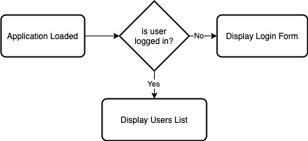
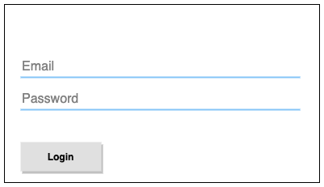

# Zoominfo Web Development Exam

## Repository Content

### Client
Angular application with 2 pages (components):
* `Login` - login form
* `Users` - dynamic list of users

### Client Components
#### Main Component


### Server
Express web server (Node.js) with 2 end-points:
* `/login`
* `/users`


## Task #1 Environment
1. Open terminal (cli) and clone this repository:
   ```shell script
   git clone  https://git.zoominfo.com/zi-academy/wd-exam.git
   ```
2. Navigate to the `client` directory and install its dependencies:
   ```shell script
   cd wd-exam/client
   npm i
   ```
3. Open another terminal window and install dependencies for the `server` too.

4. In each terminal window, start applications using the following command:
   ```shell script
   npm start
   ```
   You can leave the applications run during the exam. Any change you'll make to the code will be reloaded automatically.
   You can restart applications by running the same command again.

## Task #2 Login Form (client)
Implement login form in `login.component.html` file. Each field should validate its input (valid email, non-empty password).
* Email field.
* Password field.
* Login button.

Sample form:



### Bonus
1. Display validation status
2. Use colors to mark invalid input
3. Login button should be disabled for invalid form


## Task #3 Login bug (client/server)
Login action is an HTTP POST request to the server with email and password as payload. Hitting "Login" button with the right credentials is not working. Find and fix this bug.
* In client application, you can find login function in `app.service.ts`.
* Login end point in the server application implemented in `routes/login.js`.

## Task #4 Accessing users page bug (server)
After a login, the application display list of users, but the server refuse to return the list. 
The `/users` end point is guarded by a middleware allow only logged in users to access the data.
Find the reason it refuses to fetch data and fix it.

## Task #5 Filtering users
The `Users` page contain a filter field. Implement the filter mechanism to fetch only users with the filter content in their name.

## Task #6 Sorting users (Bonus)
Make the users table sortable.
